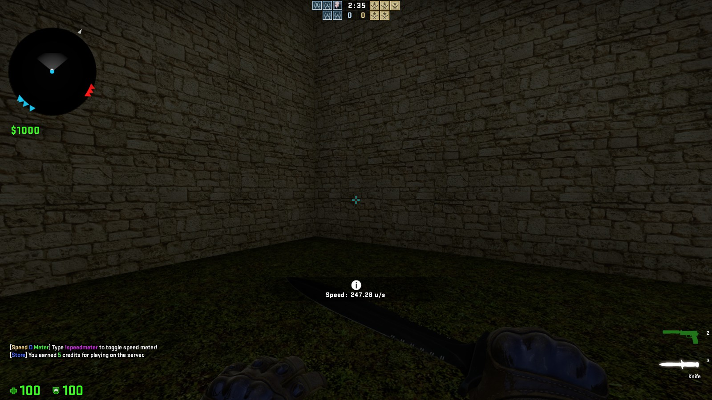
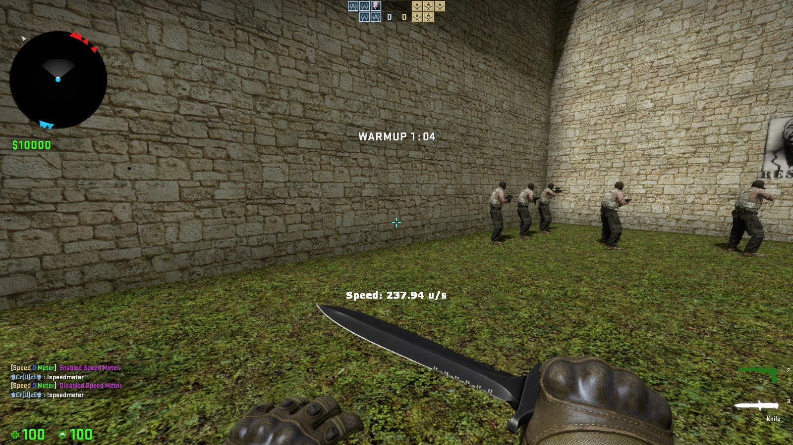

# CSGO-Simple-SpeedoMeter
 Console Command to toggle speedometer(saves your preference): `!speed, !speedmeter, !speedometer`
 
 

Click to view CVARS

 `ssm_location "1" //where should speed meter be shown. 0 = CenterHUD, 1 = New CSGO HUD`
 
 `ssm_advertinterval "2" //Interval of time between advert`

